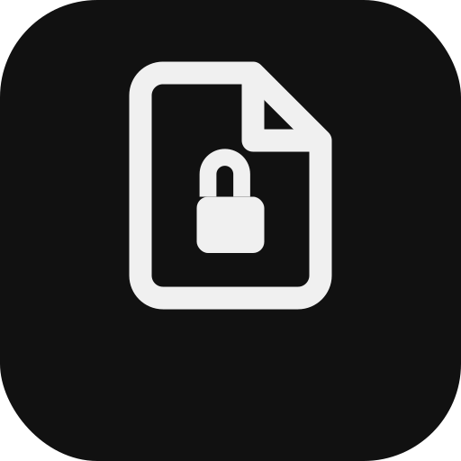
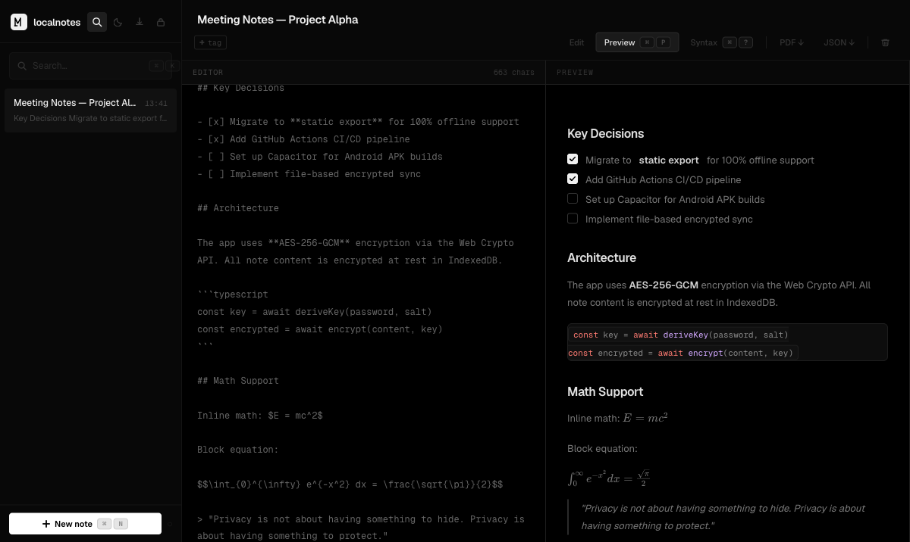
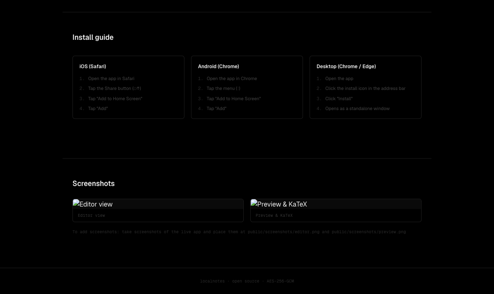

<p align="center">
  
</p>

<h1 align="center">localnotes</h1>

<p align="center">
  Encrypted notes, locally yours.<br />
  <strong>No accounts. No servers. No tracking.</strong>
</p>

<p align="center">
  <a href="https://localnotes-app.github.io/localnotes/"></a>
  <a href="https://github.com/localnotes-app/localnotes/actions"></a>
  <a href="LICENSE"></a>
  
  
</p>

---

## What is localnotes?

**localnotes** is an encrypted, offline-first Markdown note-taking app that runs entirely in your browser. Everything is encrypted with **AES-256-GCM** using the Web Crypto API. Your notes never leave your device — no accounts, no servers, no tracking.

> **[Try it live →](https://localnotes-app.github.io/localnotes/)**

## Screenshots

<p align="center">
  
  <br />
  <em>Editor view — Write in Markdown with live preview</em>
</p>

<p align="center">
  
  <br />
  <em>Landing page — Privacy-first encrypted notes</em>
</p>

## Features

- 🔒 **AES-256-GCM encryption** — note content encrypted at rest in IndexedDB
- 📴 **100% offline** — install as PWA, works without internet
- ✍️ **Markdown editor** — headings, lists, checkboxes, code blocks, tables, blockquotes
- 📐 **KaTeX math** — inline `$...$` and block `$$...$$` rendering
- 🎨 **Syntax highlighting** — code blocks with language detection
- 🏷️ **Tags + full-text search** — organize and find notes instantly
- 📄 **PDF + JSON export** — export individual notes
- 💾 **Encrypted backups** — export/import `.localnotes` backup files
- ⌨️ **Keyboard shortcuts** — `Cmd+N`, `Cmd+K`, `Cmd+P`, and more
- 🌗 **Dark & light mode** — persisted preference with manual toggle
- 📱 **Mobile responsive** — collapsible sidebar, touch-friendly on all devices
- 📲 **Installable PWA** — add to home screen on iOS, Android, and desktop

## Install

localnotes is a Progressive Web App (PWA). Visit the [live demo](https://localnotes-app.github.io/localnotes/) and install it:

| Platform | How to install |
|----------|---------------|
| **iOS (Safari)** | Tap Share (□↑) → "Add to Home Screen" |
| **Android (Chrome)** | Tap menu (⋮) → "Add to Home Screen" |
| **Desktop (Chrome/Edge)** | Click install icon in address bar → "Install" |

After installation, the app works fully offline.

## Tech Stack

| Technology | Purpose |
|------------|---------|
| [Next.js 16](https://nextjs.org/) | React framework (static export) |
| [React 19](https://react.dev/) | UI library |
| [TypeScript](https://www.typescriptlang.org/) | Type safety |
| [Tailwind CSS 4](https://tailwindcss.com/) | Utility-first styling |
| [shadcn/ui](https://ui.shadcn.com/) | Component library |
| [Web Crypto API](https://developer.mozilla.org/en-US/docs/Web/API/Web_Crypto_API) | AES-256-GCM encryption |
| [IndexedDB](https://developer.mozilla.org/en-US/docs/Web/API/IndexedDB_API) (via [idb](https://github.com/nicolo-ribaudo/idb)) | Local storage |
| [Serwist](https://serwist.pages.dev/) | Service worker / PWA |
| [react-markdown](https://github.com/remarkjs/react-markdown) | Markdown rendering |
| [KaTeX](https://katex.org/) | Math equation rendering |
| [highlight.js](https://highlightjs.org/) | Code syntax highlighting |
| [jsPDF](https://github.com/parallax/jsPDF) + [html2canvas](https://html2canvas.hertzen.com/) | PDF export |
| [Capacitor](https://capacitorjs.com/) | Native mobile support (optional) |

## Development

```bash
# Clone
git clone https://github.com/localnotes-app/localnotes.git
cd localnotes

# Install dependencies
npm install

# Start dev server
npm run dev

# Run tests
npm run test:run

# Build for production (static export)
npm run build
```

### Scripts

| Command | Description |
|---------|-------------|
| `npm run dev` | Start development server |
| `npm run build` | Build static export to `out/` |
| `npm run preview` | Preview production build locally |
| `npm run test` | Run tests in watch mode |
| `npm run test:run` | Run tests once |

## Architecture

```
app/              Next.js App Router routes
  page.tsx        Landing page (SEO-optimized)
  app/page.tsx    Notes app (client-side only)
  layout.tsx      Root layout (fonts, metadata, theme)
  sw.ts           Service worker (Serwist)

components/
  ui/             shadcn/ui components (Button, Input, Dialog, Kbd, etc.)
  auth/           Setup + Unlock screens
  notes/          App shell, editor, preview, sidebar, toolbar
  AppIcon.tsx     Shared app icon component
  InstallButton.tsx  PWA install prompt

context/
  CryptoContext   Password → PBKDF2 → CryptoKey (in-memory)
  NotesContext    CRUD operations with auto-encrypt/decrypt
  SyncContext     Native sync status (Capacitor)

hooks/
  useKeyboardShortcuts  Cross-platform keyboard shortcuts
  useInstallPrompt      PWA beforeinstallprompt handler

lib/
  crypto.ts       AES-256-GCM encrypt/decrypt, PBKDF2 key derivation
  storage.ts      IndexedDB via idb
  backup.ts       Encrypted backup export/import
  export.ts       PDF + JSON export (iframe-isolated for oklch compatibility)
  renderMarkdown.ts  Markdown → HTML for PDF (with GFM support)
```

## Security Model

localnotes takes a privacy-first approach. All encryption happens client-side — no data ever leaves your device.

| Aspect | Details |
|--------|---------|
| **Key derivation** | PBKDF2 (SHA-256, 310,000 iterations, 16-byte salt) |
| **Encryption** | AES-256-GCM with random 12-byte IV per operation |
| **CryptoKey** | Non-extractable, held in memory only |
| **No recovery** | Forgotten password = permanent data loss (by design) |
| **Plaintext fields** | Title, tags, and timestamps are **not** encrypted (trade-off for searchability) |
| **Backups** | Encrypted with separate password via same AES-256-GCM scheme |
| **No analytics** | Zero tracking, no third-party services, no telemetry |
| **Offline** | 100% functional after PWA installation |

### What's encrypted

| Data | Encrypted? |
|------|-----------|
| Note content | ✅ AES-256-GCM |
| Note titles | ❌ Stored as plaintext for search |
| Tags | ❌ Stored as plaintext for filtering |
| Timestamps | ❌ Stored as plaintext |
| Backup files | ✅ Re-encrypted with backup password |

## Contributing

Contributions are welcome! Please:

1. Fork the repository
2. Create a feature branch (`git checkout -b feature/amazing-feature`)
3. Commit your changes (`git commit -m 'Add amazing feature'`)
4. Push to the branch (`git push origin feature/amazing-feature`)
5. Open a Pull Request

## License

[MIT](LICENSE) &copy; 2026 Justus Wächter
